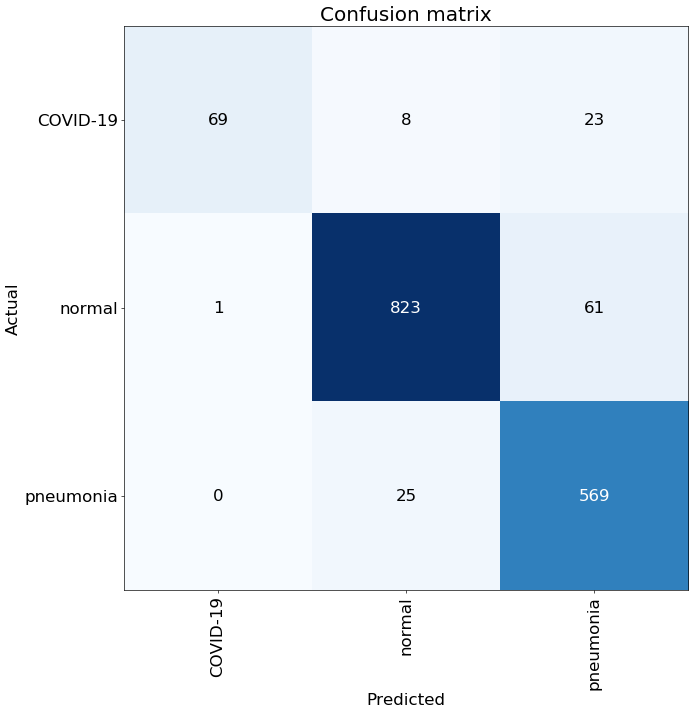
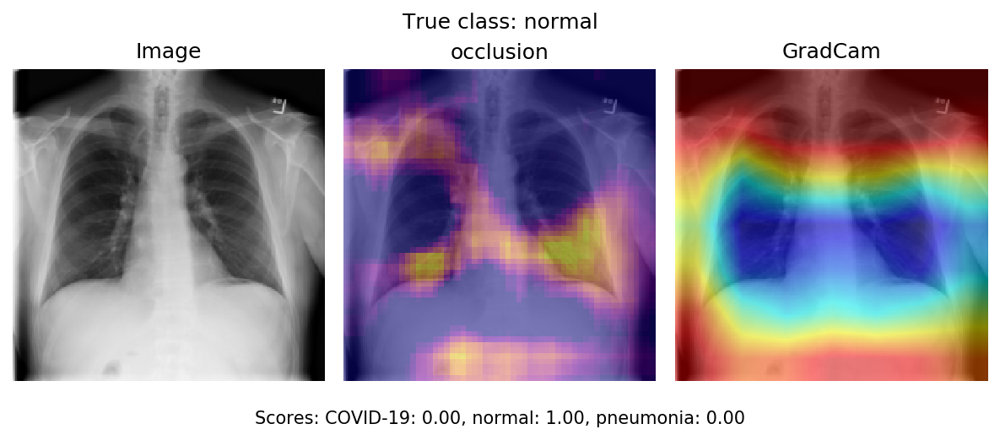
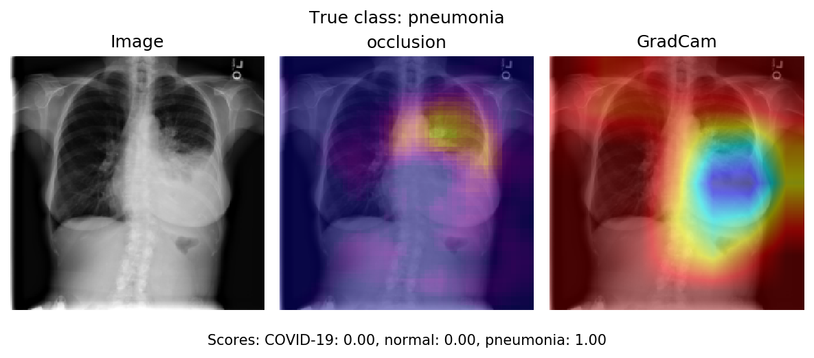
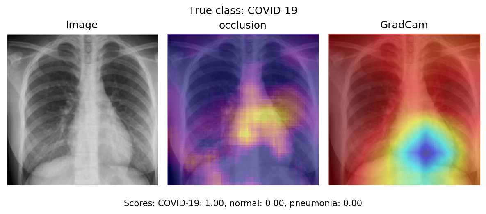
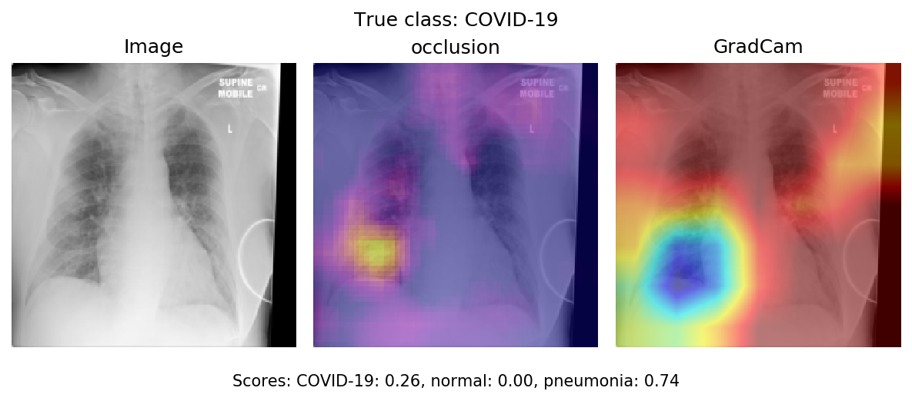
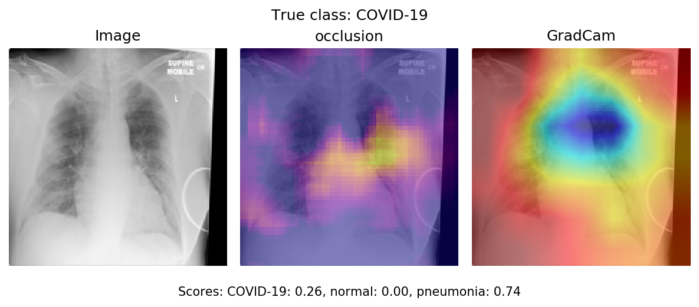
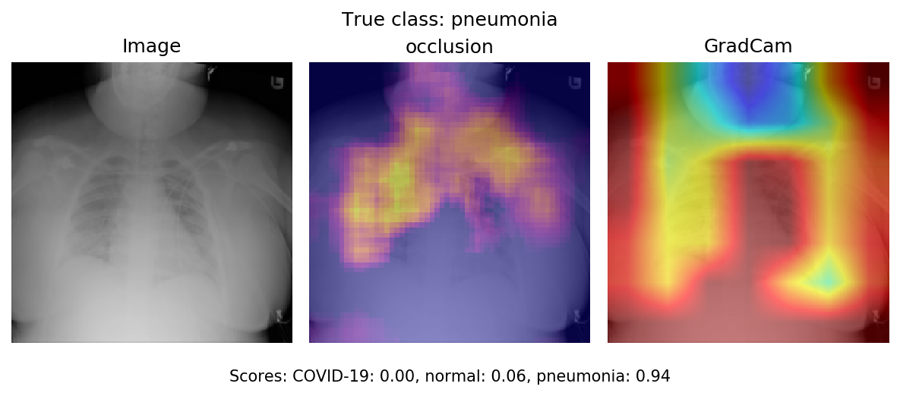

The present repository provides an example of the utilization of deep learning models to analyse X-ray images acquired in a medical context. 
More specifically, Convolutional Neural Networks (CNN) are used to classify chest X-ray images of patients suspected of being affected by a 
thoracic disease such as pneumonia or COVID-19, i.e. to predict whether a chest X-ray image has been acquired in a healthy patient or 
in a patient affected by a specific thoracic disease.

Model explainability, i.e. the ability to understand why the model returned a particular decision, is particularly important
when Artificial Intelligence is used in the health domain.
In the case of the automatic image analysis for instance via CNN models, explainability methods return the areas of the analysed image
which were particularly exploited by the model to take its decision.
Thus, they allow users to validate that the areas that contribute to prediction are indeed areas where information is located.

It allows to take a step back from the metrics used by data scientists to evaluate model performance.
They make it easier for the practitioner to better understand the model and to valide the model from a medical point of view.
In the long term, they can be a decision-making aid for the practitioner.

The present example is therefore used to illustrate the interest and limits of methods which can be used to explain the decisions of CNN models in a medical context.

## Objective and methodology

While the feasibility and limits of chest X-ray automatic analysis have been explored for several years, the Covid-19 pandemic has provided 
an additional example of the interest of fast and accurate automatic analysis of chest X-ray or CT-scans images. 
Radiologists have indeed been required to analyse a substantial number of chest images as hospitals have been overflown with patients 
suspected of having been contaminated by the coronavirus.

A 3-class classification task has here been considered, namely the automatic classification of chest X-ray images acquired in 
 **(i)** "normal" patients (i.e., patients without any thoracic disease), **(ii)** patients affected by a non covid-related pneumonia 
 and **(iii)** patients affected by the COVID-19. 
The third release of the [COVIDx dataset](https://github.com/lindawangg/COVID-Net/blob/master/docs/COVIDx.md), which is a particularly 
large covid-related dataset, has here been chosen to complete the classification task. 
Examples of chest X-ray images composing this dataset can be seen below.

90% of these images have been used to train a CNN classification model, namely a ResNet-50 [He 2016].
This classic model has been chosen because it has been shown to be efficient for chest X-ray classification in a recent study [Wang 2020].
The remaining images have been put aside during training and exclusivey used to test the model, i.e. to evaluate its ability to correctly
analyse images it had not seen during training.
They have additionally been used to compare several explainability methods.

The ResNet-50 model was trained using the script
`./scripts/train_resnet_covidx.py`. More details on the traning can be found in
[here](./scripts/README.md).

## Classification performance

The confusion matrix below summarizes the successes and errors made by the model when fed with the test images:

# 

Several classification metrics can be computed from this confusion matrix.
Three metrics have here been considered, namely the precision, the recall and the f1-score.
+ The **precision** focuses on the images which have been assigned the prediction `class c`. 
It corresponds to the proportion of these images which trully belong to the `class c`, and thus answers the question 
*"Can I trust the model when it tells me that this image belongs to `class c`?"*.
+ The **recall** focuses on the images which have trully belong to `class c`. It corresponds to the proportion of these images which 
have been correctly assigned the `class c` by the model, i.e. it answers the question "and thus answers the question
 *"Can I trust the model to find all the images which belong to `class c`?"*."
 + The **f1-score** is the harmonic mean of the precision and recall, and is computed as follows: 
 f1 = 2 * \dfrac{precision * recall}  {precision + recall}. It summarizes the model performance.

The following metrics have been obtained on the test images:

|             |   precision (PPV) |   recall (sensitivity) |     f1 |
| :---------: | :---------------: | :--------------------: | :----: |
| normal      |              0.96 |                   0.93 |   0.95 |
| pneumonia   |              0.87 |                   0.96 |   0.91 |
| COVID-19    |              0.99 |                   0.69 |   0.81 |

## Model Interpretability 

This part demonstrates that model interpretability is useful to understand why
the model does a prediction and also to identify potential ways to improve the
model.

We used two methods to identify which areas of the image are critical for the classifier's
decision:
- GradCam,
- Occlusion.

*GradCam*

GradCAM computes the gradients of the target output with respect to the last
convolutional layer, averages for each output channel (dimension 2 of output),
and multiplies the average gradient for each channel by the last convolutional
layer activations. The results are summed over all channels and a ReLU is
applied to the output, returning only non-negative attributions.

To learn more about GradCAM, visit the following resources:

- [original paper](https://arxiv.org/abs/1610.02391)
- [website](http://gradcam.cloudcv.org/)

*Occlusion*

Occlusion is a perturbation based approach to compute attribution, involving
replacing each contiguous rectangular region with a given baseline / reference,
and computing the difference in output. For features located in multiple regions
(hyperrectangles), the corresponding output differences are averaged to compute
the attribution for that feature. 

To learn more about Occlusion, visit the following resource:

- [original paper](https://arxiv.org/abs/1311.2901)

*Captum*

We used the package [captum](https://captum.ai/) to compute and visualize the
attributions. This package propose implementation of several methods to
interpret model predictions, including GradCam and Occlusion.

### Normal class 

On these images, the critical parts used by the model to predict a normal class
are located in the lungs. Moreover the whole lungs are important.

### Pneumonia class 

On this image, the critical parts for the model to predict a pneumonia class
are located in the lung inflammation.

### COVID-19 class

The critical parts used by the model to predict a COVID-19 output on this image are
located in the lung inflammation.

### Limitations of the model

Interpretation methods also allow to understand which parts of an image misled
the model into returning an erroneous prediction. The following images show
attributions for the pneumonia output and covid-19 output.

On the image above, we see can see that the model predicts pneumonia because of
a part located in right lung.

Whereas, on the image above, we see can see that the model predicts Covid19
because of a part located in left lung.

Moreover, we can see some predictions with attribution located in spurious
critical areas.

On the following image the critical area is outside of the lung. 

Further analyses of these erroneous predictions would allow to identify
potential areas of improvement for the model.

## References

[He 2016] He, Kaiming, et al. "Deep residual learning for image recognition." Proceedings of the IEEE conference on computer vision and pattern recognition. 2016.
(available [here](https://openaccess.thecvf.com/content_cvpr_2016/papers/He_Deep_Residual_Learning_CVPR_2016_paper.pdf))

[Huang 2017] Huang, Gao, et al. "Densely connected convolutional networks." Proceedings of the IEEE conference on computer vision and pattern recognition. 2017.
(available [here](https://openaccess.thecvf.com/content_cvpr_2017/papers/Huang_Densely_Connected_Convolutional_CVPR_2017_paper.pdf))

[Wang 2017] Wang, Xiaosong, et al. "Chestx-ray8: Hospital-scale chest x-ray database and benchmarks on weakly-supervised classification and localization of common thorax diseases." Proceedings of the IEEE conference on computer vision and pattern recognition. 2017.
(available [here](https://openaccess.thecvf.com/content_cvpr_2017/papers/Wang_ChestX-ray8_Hospital-Scale_Chest_CVPR_2017_paper.pdf))

[Rajpurkar 2017] Rajpurkar, Pranav, et al. "Chexnet: Radiologist-level pneumonia detection on chest x-rays with deep learning." arXiv preprint arXiv:1711.05225 (2017).
(available [here](https://arxiv.org/pdf/1711.05225.pdf%202017.pdf))

[Cohen 2019] Joseph Paul Cohen, Paul Bertin, and Vincent Frappier. Chester: A Web Delivered Locally Computed Chest X-Ray Disease Prediction System. arXiv:1901.11210, 2019.
(available [here](https://arxiv.org/pdf/1901.11210.pdf))

[Cohen 2020] Cohen, Joseph Paul, et al. "On the limits of cross-domain generalization in automated X-ray prediction." arXiv preprint arXiv:2002.02497 (2020).
(available [here](https://arxiv.org/pdf/2002.02497.pdf))

[Wang 2020] Wang, Linda, and Alexander Wong. "COVID-Net: A tailored deep convolutional neural network design for detection of COVID-19 cases from chest radiography images." arXiv preprint arXiv:2003.09871 (2020).
(available [here](https://arxiv.org/pdf/2003.09871.pdf))

[Ozturk 2020] Ozturk, Tulin, et al. "Automated detection of COVID-19 cases using deep neural networks with X-ray images." Computers in Biology and Medicine (2020): 103792.
(available [here](https://www.ncbi.nlm.nih.gov/pmc/articles/PMC7187882/))
